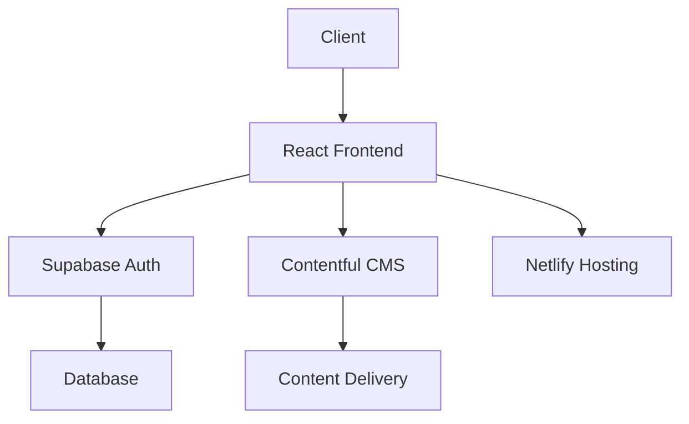
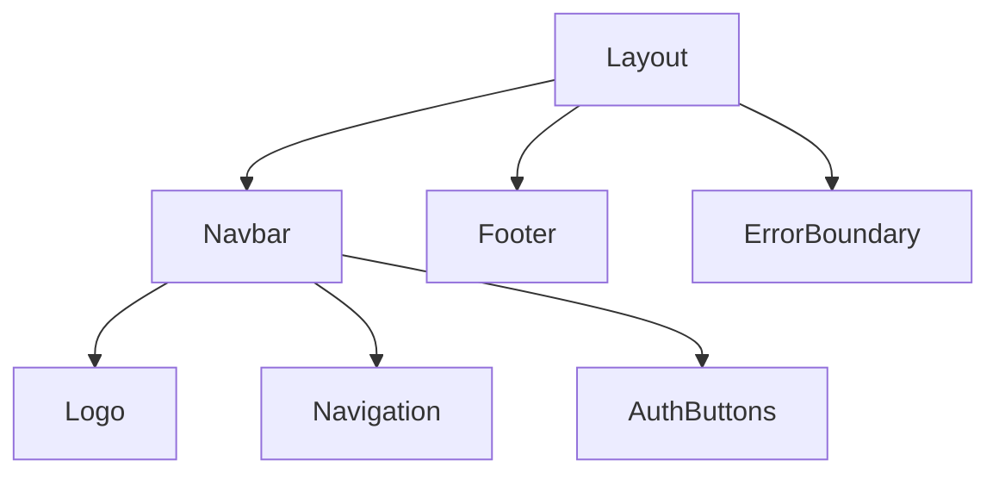
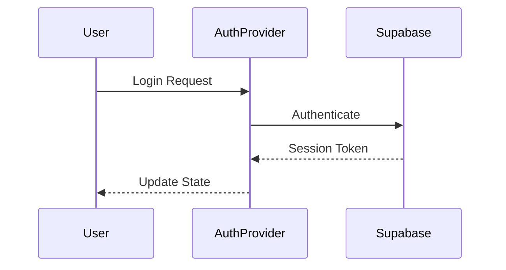
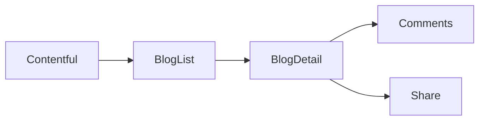
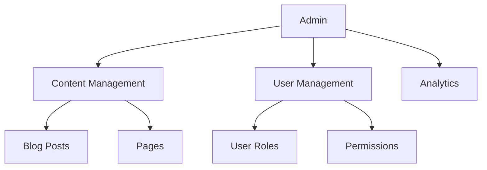
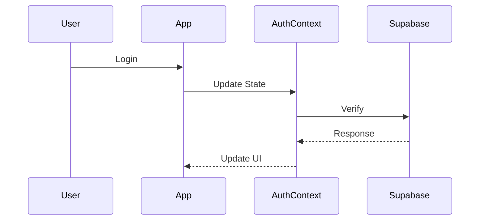
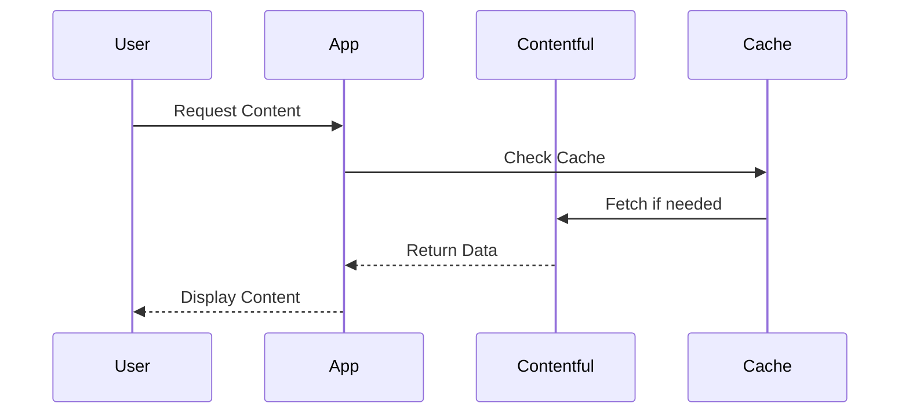
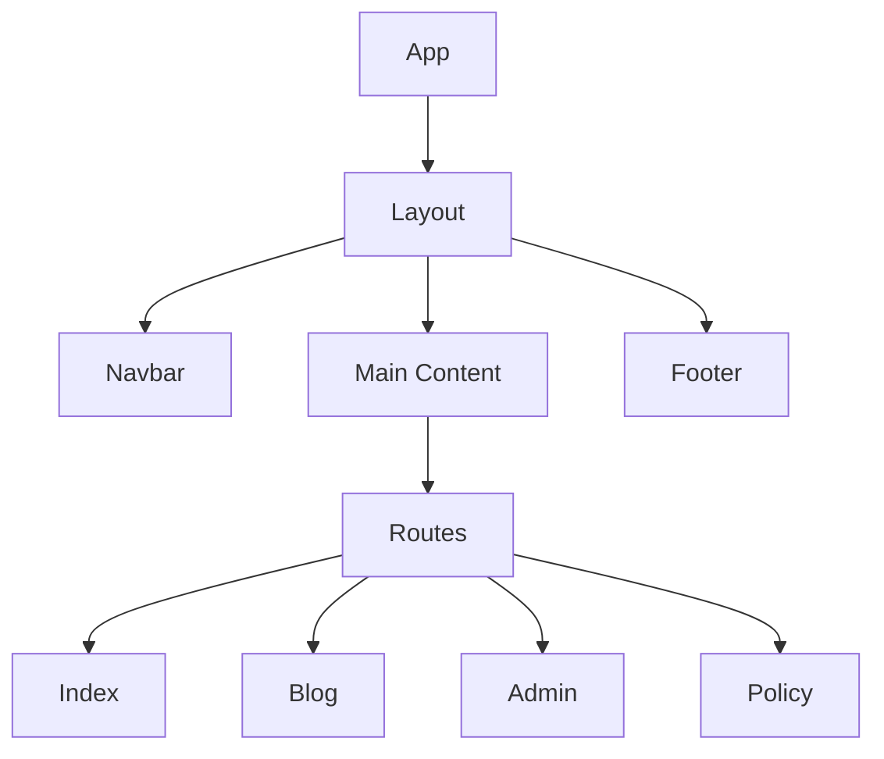
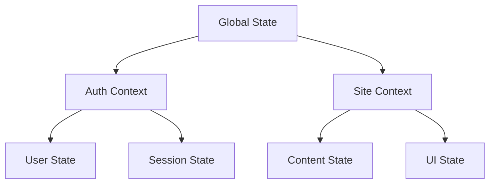

# Adhirachna Project Overview

## Table of Contents
1. [Project Architecture](#project-architecture)
2. [Component Structure](#component-structure)
3. [Feature Documentation](#feature-documentation)
4. [Data Flow](#data-flow)
5. [API Integration](#api-integration)
6. [Visual Documentation](#visual-documentation)
7. [File Structure](#file-structure)
8. [Development Guidelines](#development-guidelines)

## Project Architecture

### System Overview


### Technology Stack
- **Frontend Framework**: React 18 with TypeScript
- **State Management**: React Query, Context API
- **Authentication**: Supabase Auth
- **Content Management**: Contentful
- **Hosting**: Netlify
- **Styling**: Tailwind CSS
- **Testing**: Jest, React Testing Library

## Component Structure

### Core Components

#### 1. Layout Components


#### 2. Page Components
- `Index.tsx`: Landing page with hero section and features
- `BlogDetail.tsx`: Individual blog post view
- `PolicyPage.tsx`: Legal documentation pages
- `AdminDashboard.tsx`: Admin interface
- `ProtectedRoute.tsx`: Authentication wrapper

#### 3. Feature Components
- `BlogList.tsx`: Blog post listing
- `ContactForm.tsx`: Contact information form
- `TeamSection.tsx`: Team member display
- `ProjectGrid.tsx`: Project showcase
- `Statistics.tsx`: Key metrics display

## Feature Documentation

### 1. Authentication System


#### Key Features:
- Email/Password Authentication
- Session Management
- Protected Routes
- Role-based Access Control

### 2. Blog System


#### Features:
- Dynamic Content Loading
- SEO Optimization
- Social Sharing
- Comment System

### 3. Admin Dashboard


## Data Flow

### 1. Authentication Flow


### 2. Content Flow


## API Integration

### 1. Supabase Integration
```typescript
// Authentication
const { data: { user }, error } = await supabase.auth.signIn({
  email,
  password
});

// Database Operations
const { data, error } = await supabase
  .from('table')
  .select('*')
  .eq('column', value);
```

### 2. Contentful Integration
```typescript
// Content Fetching
const client = createClient({
  space: import.meta.env.VITE_CONTENTFUL_SPACE_ID,
  accessToken: import.meta.env.VITE_CONTENTFUL_ACCESS_TOKEN
});

// Query Content
const entries = await client.getEntries({
  content_type: 'blogPost'
});
```

## Visual Documentation

### Component Hierarchy


### State Management


## File Structure

```
src/
├── components/
│   ├── Layout/
│   ├── UI/
│   └── Features/
├── pages/
│   ├── Index.tsx
│   ├── Blog/
│   └── Admin/
├── context/
│   ├── AuthContext.tsx
│   └── SiteContext.tsx
├── hooks/
│   ├── useAuth.ts
│   └── useContent.ts
├── services/
│   ├── supabase.ts
│   └── contentful.ts
└── utils/
    ├── helpers.ts
    └── constants.ts
```

## Development Guidelines

### 1. Code Style
- Use TypeScript for type safety
- Follow React best practices
- Implement proper error handling
- Write comprehensive tests

### 2. Component Structure
```typescript
interface ComponentProps {
  // Props definition
}

const Component: React.FC<ComponentProps> = ({ prop1, prop2 }) => {
  // State management
  // Effects
  // Event handlers
  // Render logic
};
```

### 3. Testing Strategy
```typescript
describe('Component', () => {
  it('should render correctly', () => {
    // Test implementation
  });
  
  it('should handle user interactions', () => {
    // Test implementation
  });
});
```

### 4. Performance Considerations
- Implement lazy loading
- Use memoization where appropriate
- Optimize asset loading
- Implement proper caching

## Deployment Process

### 1. Local Development
```bash
# Install dependencies
npm install

# Start development server
npm run dev

# Run tests
npm test
```

### 2. Production Build
```bash
# Create production build
npm run build

# Deploy to Netlify
netlify deploy --prod
```

## Monitoring and Maintenance

### 1. Performance Monitoring
- Use React DevTools
- Monitor bundle sizes
- Track loading times
- Analyze user interactions

### 2. Error Tracking
- Implement error boundaries
- Log errors to console
- Track error patterns
- Implement user feedback

## Contributing

### 1. Setup
```bash
# Clone repository
git clone https://github.com/Dev-Somesh/adhirachna.git

# Install dependencies
npm install

# Set up environment variables
cp .env.example .env
```

### 2. Development Workflow
1. Create feature branch
2. Implement changes
3. Write tests
4. Submit pull request
5. Code review
6. Merge to main

## Support and Contact

For technical support or questions:
- Email: itdeveloper06@gmail.com
- GitHub: https://github.com/Dev-Somesh/adhirachna
- Documentation: https://github.com/Dev-Somesh/adhirachna/blob/main/TECHNICAL_DOCUMENTATION.md 