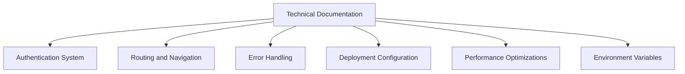
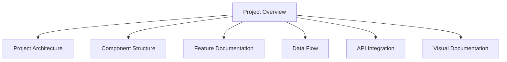
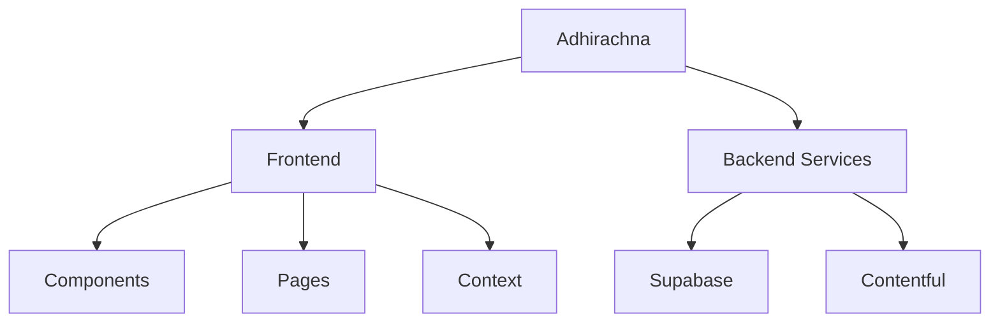
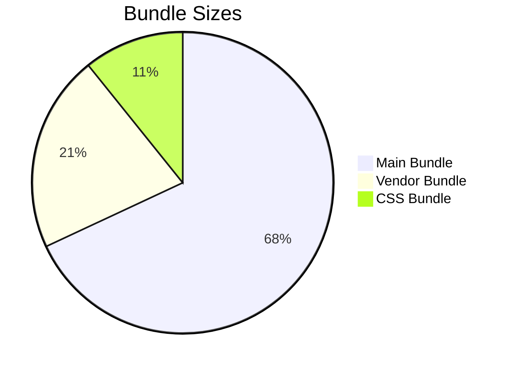

# Adhirachna

<div align="center">
  
  
  [](https://app.netlify.com/sites/your-site-name/deploys)
  [](https://github.com/Dev-Somesh/adhirachna/blob/main/LICENSE)
  [](https://www.typescriptlang.org/)
  [](https://reactjs.org/)
</div>

## 📚 Documentation

<div align="center">
  <table>
    <tr>
      <td align="center">
        <a href="https://github.com/Dev-Somesh/adhirachna/blob/main/TECHNICAL_DOCUMENTATION.md">
          
          <br/>
          <strong>Technical Documentation</strong>
        </a>
      </td>
      <td align="center">
        <a href="https://github.com/Dev-Somesh/adhirachna/blob/main/PROJECT_OVERVIEW.md">
          
          <br/>
          <strong>Project Overview</strong>
        </a>
      </td>
    </tr>
  </table>
</div>

## 🚀 Quick Start

```bash
# Clone the repository
git clone https://github.com/Dev-Somesh/adhirachna.git

# Navigate to the project directory
cd adhirachna

# Install dependencies
npm install

# Start the development server
npm run dev
```

## 📋 Documentation Overview

### Technical Documentation


### Project Overview


## 🛠️ Technology Stack

<div align="center">
  <table>
    <tr>
      <td align="center">
        
        <br/>
        <strong>React</strong>
      </td>
      <td align="center">
        
        <br/>
        <strong>TypeScript</strong>
      </td>
      <td align="center">
        
        <br/>
        <strong>Tailwind</strong>
      </td>
      <td align="center">
        
        <br/>
        <strong>Supabase</strong>
      </td>
    </tr>
  </table>
</div>

## 📊 Project Structure



## 🔍 Key Features

<div align="center">
  <table>
    <tr>
      <td>🔐 Authentication</td>
      <td>📝 Blog System</td>
      <td>👥 User Management</td>
    </tr>
    <tr>
      <td>📊 Analytics</td>
      <td>🎨 Customizable UI</td>
      <td>⚡ Performance</td>
    </tr>
  </table>
</div>

## 📈 Performance Metrics



## 🤝 Contributing

1. Fork the repository
2. Create your feature branch (`git checkout -b feature/AmazingFeature`)
3. Commit your changes (`git commit -m 'Add some AmazingFeature'`)
4. Push to the branch (`git push origin feature/AmazingFeature`)
5. Open a Pull Request

## 📫 Contact

- **Email**: itdeveloper06@gmail.com
- **GitHub**: [Dev-Somesh](https://github.com/Dev-Somesh)
- **Project Link**: [https://github.com/Dev-Somesh/adhirachna](https://github.com/Dev-Somesh/adhirachna)

## 📄 License

This project is licensed under the MIT License - see the [LICENSE](LICENSE) file for details.

## 🙏 Acknowledgments

- [React](https://reactjs.org/)
- [TypeScript](https://www.typescriptlang.org/)
- [Supabase](https://supabase.io/)
- [Contentful](https://www.contentful.com/)
- [Netlify](https://www.netlify.com/)
